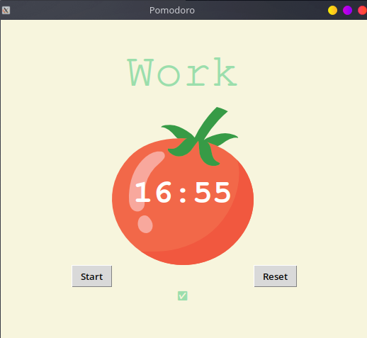

# Pomodoro Timer

A desktop Pomodoro productivity timer built with Python and Tkinter.



## What it does

Implements the [Pomodoro Technique](https://en.wikipedia.org/wiki/Pomodoro_Technique) — alternating focused work sessions with short breaks, and a long break after every 4 work sessions.

| Session | Duration |
|---------|----------|
| Work | 25 minutes |
| Short Break | 5 minutes |
| Long Break | 20 minutes |

Completed work sessions are tracked with checkmarks (✅) displayed below the timer.

## Requirements

- Python 3.x
- Tkinter (included in the Python standard library)

## Run

```bash
python main.py
```

> `tomato.png` must be in the same directory as `main.py`.

## Concepts Practiced

- Tkinter GUI layout with `Canvas`, `Label`, and `Button` widgets
- Recursive countdown using `window.after()`
- Global state management for timer repetitions
- Pomodoro session logic (work/short break/long break cycling)
